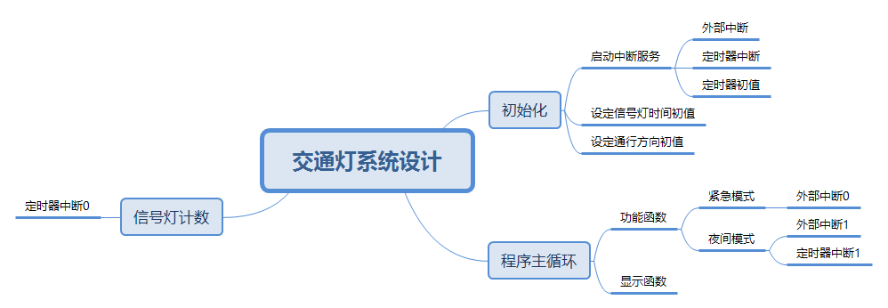
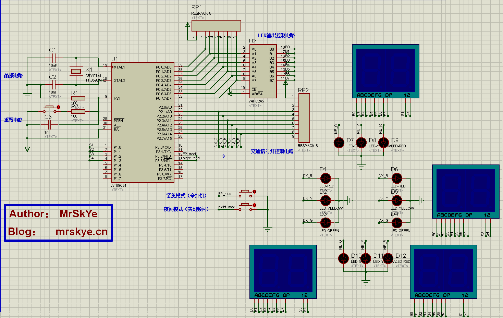
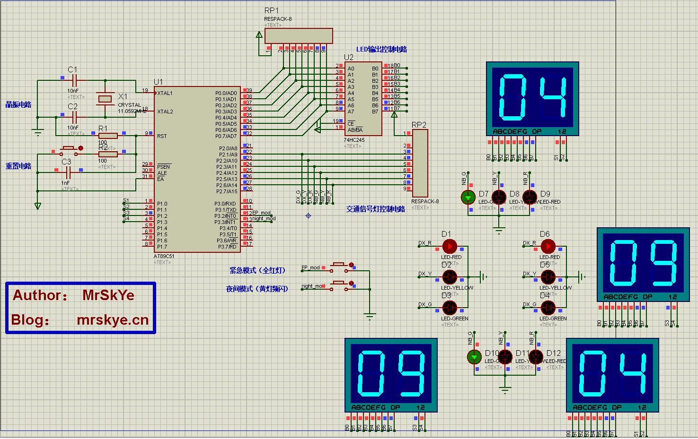
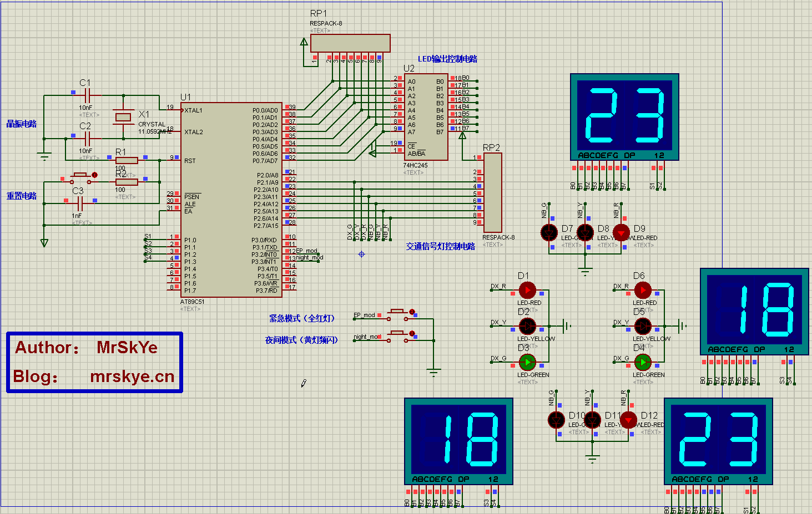

## 课程设计要求

## 实训目的

## 实训准备

1. 笔记型计算机
2. 《单片机原理及应用——基于Proteus和Keil C（第4版）》
3. VS studio 2018
4. Keil uVision4
5. ISIS 7 Professional
6. Xmind
7. Typroa

## 实训要求

设计要求：十字路口，分为东西向和南北向，在任一时刻只有一个方向通行，另一方向禁行。共有如下4种状态，循环变化。

 ⑴.南北方向红灯亮，倒计时30s，同时东西方向绿灯亮，倒计时30s，此状态下，南北方向禁止通行，东西方向直行；

 ⑵.南北方向黄灯亮，倒计时5s，同时东西方向红灯亮，倒计时30s，此状态下，除了已经正常在通行的车辆外其他车辆禁止通行；

 ⑶.南北方向绿灯亮，倒计时30s，同时东西方向红灯亮，倒计时30s，此状态下，南北方向车辆可以直行；

⑷.南北绿灯亮，倒计时30s，东西黄灯亮，倒计时5s。

## 实训内容（步骤及程序）

### 需求分析

#### 编写目的

#### 功能介绍

1. 十字路口红绿灯可在预定设置下循环变化。
2. 通行时间可自定义。
3. 两种特殊模式：夜间模式、紧急模式。

### 概要设计



### 详细设计

#### 初始化

1. ``TMOD=0X11`` 定时器模式 1 ，组成一个 16 位的定时器

2. ```c
   TH1=0x4C;							//TH1重赋初值;11.0592m晶振50ms
   TL1=0X00;
   TH0=0x4C;							//TH0重赋初值;11.0592m晶振50ms
   TL0=0X00;
   ```

   晶振频率为 11.0592M 时，定时 50ms 的初值为 0x4c、0x00

3. ``TCON=0X50`` 启动定时0、定时1

4. ``IE=0x8F`` 开总中断;定时器1中断开启;开外部中断1;定时器0中断开启;开外部中断

5. ```c
   P2=0Xc3;							//开始默认状态，东西绿灯，南北黄灯
   sec_nb=35;							//南北方向初始时间
   sec_dx=30;	
   ```

   初始化信号灯开关、时间

#### 程序主循环

```c
void main()
{
    init();								//初始化定时器、中断服务
    while(1)					 		
    {
        if(flag_option!=0)function(); 	//调用功能函数
        display(); 						//调用显示函数
    }
}
```

倒计时处理部分放在定时器中断服务中，buf 中的数字会不断刷新，主函数只需循环调用显示函数，显示倒计时。除此之外还判断是否进入特殊模式，特殊模式标志位是由外部中断修改。

#### 信号灯计数

使用定时器中断0循环计数 20 次记为 1 秒，当计数等于 20 时，进入处理倒计时数字处理逻辑部分。进入后首先重置计数器，然后各个方向时间 -1 ：

```c
if(countt0==20)	                  	//定时器中断次数=20时（即1秒时）
{	
    countt0=0;						//清零计数器
    sec_dx--;						//东西时间减1
    sec_nb--;						//南北时间减1 
```

时间 -1 后需要进一步判断是否需要切换状态。需要处理的有两种：

1. 黄灯频闪：非通行方向时间剩余 5 秒，通行方向时间剩余 0 秒
2. 切换通行方向：通行方向时间剩余 0 秒，非通行方向时间剩余 0 秒，且已经在黄灯频闪状态

##### 黄灯频闪

进入条件：任意一个方向时间剩余 5 秒，另外一个方向时间剩余 0 秒，黄灯闪烁标志为 0 。处理方法是将通行方向增加 5 秒用于黄灯频闪。

```c
if(sec_nb==0&&sec_dx==5&&(Yellow_status==0))		//当南北倒计时到0时，重置5秒，用于黄灯闪烁时间
{
    sec_nb=5;
    Yellow_status=1;
}
```

进入黄灯闪烁模式后，判断通行方向，关闭通行方向绿灯、取反黄灯状态。

```c
if((sec_dx<=5)&&(dx_nb==1)&&(Yellow_status==1))  		//南北黄灯闪
{
    Green_nb=0;
    Yellow_nb=~Yellow_nb;
}
```

另外一个方向的处理逻辑一致。

##### 切换通行方向

进入条件：当黄灯时间、通行方向倒计时到0时

```c
if(dx_nb==1&&sec_dx==0&&sec_nb==0)			            //南北通行：当黄灯时间、通行方向倒计时到0时
        {
            P2=0X00;					//重置东西南北的红绿灯状态
            Green_dx=1;					//东西绿灯亮
            Red_nb=1;					//南北红灯亮
            dx_nb=!dx_nb;				//交换通行方向
            Yellow_status=0;					//关闭黄灯闪烁
            sec_dx=set_timedx;		//重赋东西方向的起始值
            sec_nb=set_timenb+5;			//重赋南北方向的起始值
        }
```

#### 功能函数

##### 紧急模式

> 全部方向红灯

用外部中断0改变全局标志位来进入函数：

```c
void int0(void) interrupt 0 using 1	    //禁止通行
{
    while(!key_EP)display();
    flag_option=1;
}
```

处理逻辑：关交通灯定时器、灭显示、全部置红灯

```c
TR0=0;						//关交通灯定时器
P2=0x00;					//灭显示
Red_dx=1;                   //全部置红灯
Red_nb=1;
```

恢复逻辑：

```c
TR0=1;						//开交通灯定时器
P2=0X00;					//关全部信号灯
Green_dx=1;					//东西绿灯亮
Red_nb=1;					//南北红灯亮
sec_dx=set_timedx;          //回到初值
sec_nb=sec_dx+5;
```

通过一个计数器实现进入与恢复：

```c
conut_ER=1-conut_ER;
if(conut_ER==1){}		
if(conut_ER==0){}	
```

##### 夜间模式

> 全部方向黄灯频闪

处理逻辑大致与上面一样，差异是控制频闪放在定时器中断1服务中。这里功能函数修改一个全局标志位，让定时器1启动输出。

```c
conut_night=1-conut_night;
if(conut_night==1)
{
    TR0=0;						//关交通灯定时器
    P2=0x00;                    //关全部信号灯
    flag_Night=1;               //打开夜间模式
    sec_dx=00;					//四个方向的时间都为00
    sec_nb=00;
}
if(conut_night==0)
{
    TR0=1;						//开交通灯定时器
    P2=0x00;                    //关全部信号灯
    Green_dx=1;					//东西绿灯亮
    Red_nb=1;					//南北红灯亮
    flag_Night=0;               //打开夜间模式
    sec_dx=set_timedx;          //回到初值
    sec_nb=sec_dx+5;
}
flag_option=0;
break;
```

定时器1中断服务，控制黄灯每 0.5 s 反转一次。

## 实训结果

1. 模拟电路电路图：

   

2. 信号控制演示

   

3. 紧急模式

   

4. 夜间模式

   

## 实训小结(心得及体会)

## 附录

### Github 仓库

该项目托管在Github@[skyedai910](https://github.com/skyedai910)/**[traffic-lights-BC](https://github.com/skyedai910/traffic-lights-BC)**

https://github.com/skyedai910/traffic-lights-BC

### 交通灯系统设计源码

```c
/*
prj name: 简易交通灯设计
coding	: gbk
File    : mian.c
Author  : MrSkYe
Email   : skye231@foxmail.com
*/
#include <reg51.h>

sbit Red_nb=P2^6;		                //南北红灯标志
sbit Yellow_nb=P2^5;	                //南北黄灯标志
sbit Green_nb=P2^4;                     //南北绿灯标志

sbit Red_dx=P2^3;		                //东西红灯标志
sbit Yellow_dx=P2^2;	                //东西黄灯标志
sbit Green_dx=P2^1;		                //东西绿灯标志

bit dx_nb=0;			                //东西南北控制位
bit Yellow_status=0;	                //黄灯闪烁标志位

unsigned char  sec_dx;  		    	//东西方向时间存储变量
unsigned char  sec_nb;			    	//南北方向时间存储变量
float  set_timedx=30;			    	//东西方向的通行单次时间
float  set_timenb=30;				    //南北方向的通行单次时间
unsigned char  buf[4];				    //秒显示的变量
unsigned char data countt0;             //定时器0中断计数器
unsigned char data countt1;             //定时器1中断计数器

unsigned char flag_option=0;            //功能选择位:1 紧急模式；2 夜间模式

sbit  key_EP=P3^2;		                //紧急模式
unsigned char conut_ER;                 //紧急状态

sbit  key_night=P3^3;		            //夜间模式
unsigned char flag_Night;		        //夜间状态
unsigned char conut_night;              //夜间模式

unsigned char code led[11]={	        //共阴极字型码
    0x3f,  //--0
    0x06,  //--1
    0x5b,  //--2
    0x4f,  //--3
    0x66,  //--4
    0x6d,  //--5
    0x7d,  //--6
    0x07,  //--7
    0x7f,  //--8
    0x6f,  //--9
    0x00   //--NULL
};


/*延时函数*/
void delay(int time)
{
    unsigned int j,k;
    for(j=0;j<time;j++)			
       for(k=0;k<124;k++);		
}

/*显示函数*/
void display(void)
{
    buf[0]=sec_nb/10; 		//第1位 东西十位
    buf[1]=sec_nb%10; 		//第2位 东西个位
    buf[2]=sec_dx/10; 		//第3位 南北十位
    buf[3]=sec_dx%10; 		//第4位 南北个位
    P1=0xfe;           		//LED1
    P0=led[buf[0]];		    //东西十位
    delay(1);
    P1=0xfd;             	//LED2
    P0=led[buf[1]];		    //东西个位
    delay(1);				
    P1=0Xfb;		  		//LED3
    P0=led[buf[2]];		    //南北十位
    delay(1);				
    P1=0Xf7;				//LED4
    P0=led[buf[3]];		    //南北个位
    delay(1);				
}

/*功能函数*/
void function(void)
{
    switch (flag_option)
    {
        case 1:
        {
            conut_ER=1-conut_ER;
            if(conut_ER==1)
            {
                TR0=0;						//关交通灯定时器
                P2=0x00;					//关全部信号灯
                Red_dx=1;                   //全部置红灯
                Red_nb=1;
            }		
            if(conut_ER==0)
            {
                TR0=1;						//开交通灯定时器
                P2=0X00;					//关全部信号灯
                Green_dx=1;					//东西绿灯亮
                Red_nb=1;					//南北红灯亮
                sec_dx=set_timedx;          //回到初值
                sec_nb=sec_dx+5;
            }	
            flag_option=0;	
            break;
        }
        case 2:
        {
            conut_night=1-conut_night;
            if(conut_night==1)
            {
                TR0=0;						//关交通灯定时器
                P2=0x00;                    //关全部信号灯
                flag_Night=1;               //打开夜间模式
                sec_dx=00;					//四个方向的时间都为00
                sec_nb=00;
            }
            if(conut_night==0)
            {
                TR0=1;						//开交通灯定时器
                P2=0x00;                    //关全部信号灯
                Green_dx=1;					//东西绿灯亮
                Red_nb=1;					//南北红灯亮
                flag_Night=0;               //打开夜间模式
                sec_dx=set_timedx;          //回到初值
                sec_nb=sec_dx+5;
            }
            flag_option=0;
            break;
        }
        default:
            break;
    }
}

/*处理整个交通灯计时*/
void time0(void) interrupt 1 using 1  	//定时中断子程序
{
    TH0=0x4C;							//重赋初值;11.0592m晶振50ms
    TL0=0X00;
    TR0=1;								//开交通灯定时器
    countt0++;							//计数器数加1（用于计算时间）
    if(countt0==20)	                  	//定时器中断次数=20时（即1秒时）
    {	
        countt0=0;						//清零计数器
        sec_dx--;						//东西时间减1
        sec_nb--;						//南北时间减1
        if(sec_nb==0&&sec_dx==5&&(Yellow_status==0))		//当南北倒计时到0时，重置5秒，用于黄灯闪烁时间
        {
            sec_nb=5;
            Yellow_status=1;
        }
        if(sec_dx==0&&sec_nb==5&&(Yellow_status==0)) 		//当东西倒计时到0时，重置5秒，用于黄灯闪烁时间
        {
            sec_dx=5;
            Yellow_status=1;			//启动黄灯开始倒计时
        }
        if((sec_nb<=5)&&(dx_nb==0)&&(Yellow_status==1))  		//东西黄灯闪
        {
            Green_dx=0;
            Yellow_dx=~Yellow_dx;
        }
        if((sec_dx<=5)&&(dx_nb==1)&&(Yellow_status==1))  		//南北黄灯闪
        {
            Green_nb=0;
            Yellow_nb=~Yellow_nb;
        }
        if(dx_nb==0&&sec_nb==0&&sec_dx==0)			            //东西通行：当黄灯时间、通行方向倒计时到0时
        {
            P2=0x00;					//重置东西南背方向的红绿灯
            Green_nb=1;					//南北绿灯亮
            Red_dx=1;					//东西红灯亮
            dx_nb=!dx_nb;				//交换通行方向
            Yellow_status=0;			//关闭黄灯闪烁
            sec_dx=set_timedx+5;			//重赋东西方向的起始值
            sec_nb=set_timenb;		//重赋南北方向的起始值
        }
        if(dx_nb==1&&sec_dx==0&&sec_nb==0)			            //南北通行：当黄灯时间、通行方向倒计时到0时
        {
            P2=0X00;					//重置东西南北的红绿灯状态
            Green_dx=1;					//东西绿灯亮
            Red_nb=1;					//南北红灯亮
            dx_nb=!dx_nb;				//交换通行方向
            Yellow_status=0;					//关闭黄灯闪烁
            sec_dx=set_timedx;		//重赋东西方向的起始值
            sec_nb=set_timenb+5;			//重赋南北方向的起始值
        }
    }
}

/*用来处理夜间黄灯闪烁*/
void time1(void) interrupt 3 			//定时中断子程序
{
    TH1=0x4C;							//重赋初值;11.0592m晶振50ms
    TL1=0X00;
    countt1++;							//计数器数加1（用于计算时间）
    if(countt1==10)					    //定时器中断次数=10时（即0.5秒）
	{	   
		if(flag_Night==1)
	    {
			Yellow_nb=~Yellow_nb;		//南北黄灯
			Yellow_dx=~Yellow_nb;		//东西黄灯   
		}	
	} 
    if(countt1==20)	                  	//定时器中断次数=20时（即1秒时）
    {
        countt1=0;						//清零计数器
        if(flag_Night==1)
        {
            Yellow_nb=~Yellow_nb;		//南北黄灯
            Yellow_dx=~Yellow_nb;		//东西黄灯
        }
    }
}


//外部中断0
void int0(void) interrupt 0 using 1	    //紧急模式
{
    while(!key_EP)display();
    flag_option=1;
}

//外部中断1
void int1(void) interrupt 2 using 1	    //夜间模式
{
    while(!key_night)display();
    flag_option=2;
}

/*初始化函数*/
void init()
{
    TMOD=0X11;	   						//定时器设置
    TH1=0x4C;							//TH1重赋初值;11.0592m晶振50ms
    TL1=0X00;
    TH0=0x4C;							//TH0重赋初值;11.0592m晶振50ms
    TL0=0X00;
    TCON=0X50;							//启动定时0、定时1
    IE=0x8F;							//开总中断;定时器1中断开启;开外部中断1;定时器0中断开启;开外部中断
    P2=0Xc3;							//开始默认状态，东西绿灯，南北黄灯
    sec_nb=35;							//南北方向初始时间
    sec_dx=30;							//东西方向初始时间
}

//主程序
void main()
{
    init();								//初始化定时器、中断服务
    while(1)					 		
    {
        if(flag_option!=0)function(); 	//调用功能函数
        display(); 						//调用显示函数
    }
}
```

